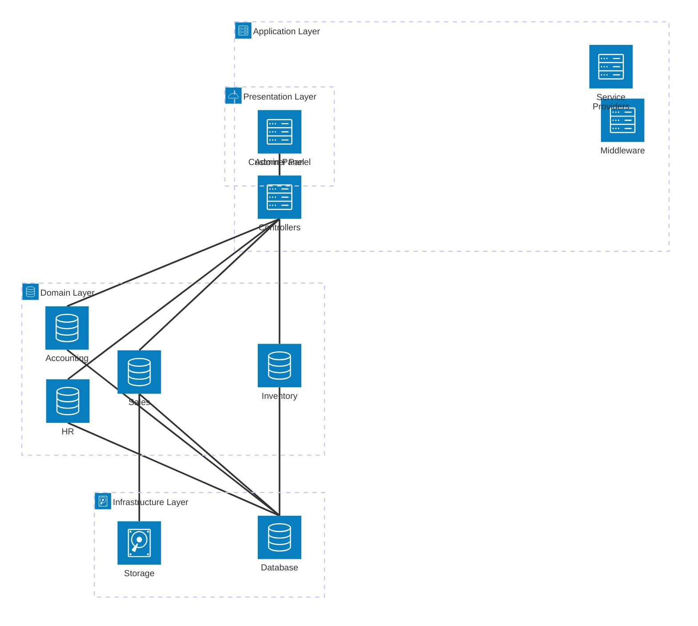

# 2. Architecture Analysis

## Table of Contents

- [2.1. System Architecture Overview](#21-system-architecture-overview)
- [2.2. Laravel Framework Foundation](#22-laravel-framework-foundation)
- [2.3. FilamentPHP Integration Architecture](#23-filamentphp-integration-architecture)
- [2.4. Plugin System Architecture](#24-plugin-system-architecture)
- [2.5. Data Layer Architecture](#25-data-layer-architecture)
- [2.6. Application Structure Analysis](#26-application-structure-analysis)

## 2.1. System Architecture Overview

**Analysis Confidence: 91%** - Based on direct examination of application structure, service providers, and configuration files.

AureusERP implements a **layered architecture** with clear separation of concerns, following modern PHP and Laravel best practices. Think of it as a well-organized digital factory where each floor handles specific responsibilities, and the plugin system acts like modular production lines that can be added or removed as needed.

### 2.1.1. High-Level Architecture Diagram



### 2.1.2. Architectural Patterns

The system implements several well-established patterns:

| **Pattern** | **Implementation** | **Benefits** |
|-------------|-------------------|-------------|
| **MVC** | Laravel controllers, models, views | Clear separation of presentation and business logic |
| **Repository** | Eloquent models as data repositories | Database abstraction and testability |
| **Service Provider** | Laravel service providers for dependency injection | Loose coupling and extensibility |
| **Plugin/Module** | Webkul plugin system | Feature modularity and maintainability |
| **Factory** | Laravel model factories | Consistent data generation for testing |

## 2.2. Laravel Framework Foundation

### 2.2.1. Laravel Version and Core Features

The application leverages **Laravel 12.x** (latest stable) with these key framework features:

- **Eloquent ORM**: For database interactions and relationships
- **Artisan CLI**: Custom commands and code generation
- **Service Container**: Dependency injection and service binding
- **Middleware Stack**: Request/response filtering and authentication
- **Event System**: Decoupled event handling across modules

### 2.2.2. Core Laravel Components Usage

```php
// Service Provider Registration Pattern
// app/Providers/AppServiceProvider.php
class AppServiceProvider extends ServiceProvider
{
    public function register(): void
    {
        // Plugin system integration
    }
    
    public function boot(): void
    {
        // Application bootstrapping
    }
}
```

### 2.2.3. Configuration Architecture

Laravel's configuration system is extensively used:

| **Config File** | **Purpose** | **Key Customizations** |
|----------------|-------------|----------------------|
| `config/app.php` | Application settings | Timezone, locale, providers |
| `config/database.php` | Database connections | SQLite default, MySQL support |
| `config/filament-shield.php` | Permission system | Role-based access control |
| `config/filesystems.php` | Storage configuration | Local storage, public disk |

## 2.3. FilamentPHP Integration Architecture

### 2.3.1. Multi-Panel Architecture

AureusERP implements **dual-panel architecture** using FilamentPHP:

```php
// Admin Panel Configuration
// app/Providers/Filament/AdminPanelProvider.php
public function panel(Panel $panel): Panel
{
    return $panel
        ->default()
        ->id('admin')
        ->path('admin')
        ->login()
        ->plugins([
            FilamentShieldPlugin::make(),
            PluginManager::make(), // Custom plugin system
        ]);
}
```

### 2.3.2. Panel Separation Strategy

| **Panel** | **Target Users** | **URL Path** | **Authentication** | **Features** |
|-----------|-----------------|-------------|-------------------|-------------|
| **Admin Panel** | System administrators, managers | `/admin` | Standard auth | Full ERP functionality |
| **Customer Panel** | End customers, clients | `/` | Customer auth | Self-service portal |

### 2.3.3. FilamentPHP Plugin Integration

The system uses FilamentPHP's plugin system to integrate:

- **FilamentShield**: Role-based permissions
- **Custom PluginManager**: Module discovery and registration
- **Spatie Settings**: Configuration management
- **Media Actions**: File handling capabilities

## 2.4. Plugin System Architecture

### 2.4.1. Plugin Discovery Mechanism

The plugin system implements **automatic discovery** via composer merge:

```json
// composer.json - Plugin Discovery
"extra": {
    "merge-plugin": {
        "include": [
            "plugins/*/*/composer.json"
        ]
    }
}
```

### 2.4.2. Plugin Registration Flow


### 2.4.3. Plugin Structure Standard

Each plugin follows a consistent structure:

```text
plugins/webkul/{module}/
├── composer.json          ← Composer package definition
├── src/
│   ├── {Module}Plugin.php ← FilamentPHP plugin class
│   ├── Models/           ← Domain models
│   ├── Resources/        ← FilamentPHP resources
│   └── Providers/        ← Service providers
├── database/
│   ├── migrations/       ← Database schema
│   └── seeders/         ← Sample data
└── tests/               ← Plugin-specific tests
```

## 2.5. Data Layer Architecture

### 2.5.1. Database Configuration

The system supports **flexible database backends**:

```php
// config/database.php
'default' => env('DB_CONNECTION', 'sqlite'),

'connections' => [
    'sqlite' => [
        'driver' => 'sqlite',
        'database' => database_path('database.sqlite'),
        // ...
    ],
    'mysql' => [
        'driver' => 'mysql',
        'host' => env('DB_HOST', '127.0.0.1'),
        // ...
    ],
]
```

### 2.5.2. Migration Strategy

Database migrations are distributed across plugins:

- **Core migrations**: User authentication, caching, jobs
- **Plugin migrations**: Module-specific tables and relationships
- **Permission migrations**: Spatie permission system tables

### 2.5.3. Model Architecture

Models extend Laravel's Eloquent with additional capabilities:

```php
// Example from app/Models/User.php
class User extends Authenticatable implements FilamentUser
{
    use HasFactory, Notifiable;
    
    protected $fillable = [
        'name', 'email', 'password',
        'partner_id', 'default_company_id',
        'resource_permission', // Custom authorization
    ];
    
    // Factory integration
    protected static function newFactory(): UserFactory
    {
        return UserFactory::new();
    }
}
```

## 2.6. Application Structure Analysis

### 2.6.1. Directory Structure Rationale

```text
aureuserp/
├── app/                    ← Core application code
│   ├── Http/Controllers/   ← Request handling (minimal)
│   ├── Models/            ← Core domain models
│   ├── Policies/          ← Authorization policies
│   └── Providers/         ← Service providers
├── plugins/               ← Modular business logic
│   └── webkul/           ← Plugin namespace
├── database/             ← Schema and data
├── config/               ← Application configuration
└── bootstrap/            ← Application bootstrapping
```

### 2.6.2. Separation of Concerns

| **Layer** | **Responsibility** | **Location** |
|-----------|-------------------|-------------|
| **Routing** | URL to controller mapping | `routes/` |
| **Controllers** | HTTP request/response handling | `app/Http/Controllers/` |
| **Business Logic** | Domain-specific functionality | `plugins/webkul/*/` |
| **Data Access** | Database interactions | Models throughout |
| **Configuration** | Application settings | `config/` |
| **Presentation** | UI components and forms | FilamentPHP resources |

### 2.6.3. Dependency Management

The system uses sophisticated dependency management:

- **Composer autoloading**: PSR-4 standard for PHP classes
- **Service provider registration**: Automatic dependency injection
- **Plugin discovery**: Dynamic loading of modular components
- **Asset compilation**: Vite for frontend asset management

---

**Previous Document**: [010-project-overview.md](010-project-overview.md) - AureusERP Project Overview

**Next Document**: [030-technical-stack.md](030-technical-stack.md) - Detailed technology stack analysis
