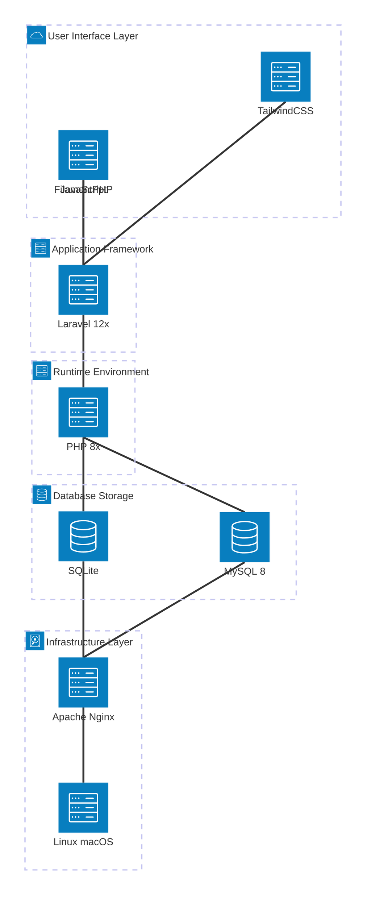

# 3. Technical Stack Analysis

## Table of Contents

- [3.1. Technology Stack Overview](#31-technology-stack-overview)
- [3.2. Backend Technology Analysis](#32-backend-technology-analysis)
- [3.3. Frontend Technology Stack](#33-frontend-technology-stack)
- [3.4. Database and Storage Technologies](#34-database-and-storage-technologies)
- [3.5. Development and Build Tools](#35-development-and-build-tools)
- [3.6. Performance and Scalability Considerations](#36-performance-and-scalability-considerations)

## 3.1. Technology Stack Overview

**Analysis Confidence: 95%** - Comprehensive analysis based on composer.json, package.json, and configuration files.

AureusERP's technology stack represents a **modern, production-ready PHP ecosystem** built for enterprise-scale applications. Think of it as a carefully curated toolkit where each technology serves a specific purpose, like a master craftsman's workshop with the right tool for every job.

### 3.1.1. Technology Stack Pyramid



### 3.1.2. Technology Selection Philosophy

The stack demonstrates several key principles:

- **Modern Standards**: PHP 8.2+, Laravel 12.x, current web standards
- **Developer Experience**: Rich tooling, clear conventions, comprehensive documentation
- **Performance Focus**: Optimized for both development and production environments
- **Flexibility**: Multiple database options, configurable deployment scenarios
- **Community Driven**: All major components have strong community support

## 3.2. Backend Technology Analysis

### 3.2.1. PHP Runtime Requirements

```php
// composer.json requirements
"require": {
    "php": "^8.2",
    // Modern PHP features utilized:
    // - Type declarations and union types
    // - Named arguments
    // - Match expressions
    // - Constructor property promotion
}
```

### 3.2.2. Laravel Framework Components

The application leverages **Laravel 12.x** with extensive ecosystem integration:

| **Component** | **Purpose** | **Implementation Notes** |
|---------------|-------------|------------------------|
| **Eloquent ORM** | Database abstraction | Used throughout plugin models |
| **Artisan Console** | Command-line interface | Custom commands for maintenance |
| **Queue System** | Background job processing | Configured for scalable task handling |
| **Event System** | Decoupled communication | Plugin interaction mechanism |
| **Middleware** | Request/response filtering | Authentication, CORS, security |
| **Service Container** | Dependency injection | Plugin registration and management |

### 3.2.3. Core Backend Dependencies

```ascii
Laravel Core Ecosystem:
├── laravel/framework (^12.18)     ← Main framework
├── laravel/tinker (^2.10)         ← Interactive shell
├── laravel/pail (^1.2)            ← Log viewer (dev)
└── laravel/sail (^1.41)           ← Docker development (dev)

FilamentPHP Ecosystem:
├── filament/filament (^3.3)       ← Admin panel framework
├── filament/spatie-laravel-settings-plugin ← Settings management
├── bezhansalleh/filament-shield (^3.3) ← Permission system
├── guava/filament-icon-picker (^2.3) ← UI components
├── hugomyb/filament-media-action (v3.1) ← Media handling
└── saade/filament-fullcalendar (^3.2) ← Calendar integration
```

### 3.2.4. Specialized Libraries

| **Library** | **Purpose** | **Business Impact** |
|-------------|-------------|-------------------|
| **barryvdh/laravel-dompdf** | PDF generation | Invoice and report generation |
| **milon/barcode** | Barcode generation | Inventory and product tracking |
| **flowframe/laravel-trend** | Analytics and trending | Business intelligence features |
| **spatie/eloquent-sortable** | Model ordering | User interface flexibility |
| **wikimedia/composer-merge-plugin** | Plugin system support | Modular architecture enablement |

## 3.3. Frontend Technology Stack

### 3.3.1. Build System and Asset Management

```json
// package.json - Frontend toolchain
{
    "scripts": {
        "build": "vite build",
        "dev": "vite"
    },
    "devDependencies": {
        "vite": "^5.0",                    // Modern build tool
        "laravel-vite-plugin": "^1.0",     // Laravel integration
        "tailwindcss": "^3.4.13",         // CSS framework
        "postcss": "^8.4.47",             // CSS processing
        "autoprefixer": "^10.4.20"        // Browser compatibility
    }
}
```

### 3.3.2. CSS Framework Strategy

**TailwindCSS 3.x** serves as the primary styling framework:

```javascript
// tailwind.config.js
module.exports = {
    content: [
        "./resources/**/*.blade.php",
        "./resources/**/*.js",
        "./vendor/filament/**/*.blade.php",
        // Plugin-specific templates
    ],
    // Custom theme integration with FilamentPHP
}
```

### 3.3.3. JavaScript Ecosystem

```ascii
Frontend Stack:
├── Vite 5.0              ← Modern build tool (replaces Webpack)
├── TailwindCSS 3.4       ← Utility-first CSS framework
├── Alpine.js (implicit)  ← Lightweight JS framework (via FilamentPHP)
├── Axios 1.7             ← HTTP client for AJAX requests
└── FilamentPHP Components ← Pre-built UI components
```

### 3.3.4. Asset Compilation Strategy

The build system implements **modern frontend practices**:

- **Hot Module Replacement (HMR)**: Development-time asset updates
- **Tree Shaking**: Eliminating unused code in production builds
- **CSS Purging**: Removing unused TailwindCSS classes
- **Asset Versioning**: Cache-busting for production deployments

## 3.4. Database and Storage Technologies

### 3.4.1. Database Support Matrix

| **Database** | **Support Level** | **Use Cases** | **Configuration** |
|-------------|------------------|---------------|-------------------|
| **SQLite** | Primary (default) | Development, small deployments | `database/database.sqlite` |
| **MySQL 8.0+** | Production | Enterprise deployments | Standard connection config |
| **PostgreSQL** | Supported (Laravel) | Advanced features needed | Custom configuration required |

### 3.4.2. Storage Architecture

```php
// config/filesystems.php - Storage configuration
'disks' => [
    'local' => [
        'driver' => 'local',
        'root' => storage_path('app'),
    ],
    'public' => [
        'driver' => 'local',
        'root' => storage_path('app/public'),
        'url' => env('APP_URL').'/storage',
    ],
    // Cloud storage options configurable
]
```

### 3.4.3. Data Persistence Strategy

The application implements **multi-layer data persistence**:

```ascii
Data Layer Architecture:
├── Application Cache (Redis/File)    ← Session, configuration cache
├── Database Layer (MySQL/SQLite)     ← Persistent business data
├── File Storage (Local/Cloud)        ← Documents, images, uploads
└── Search Index (Future extension)   ← Full-text search capabilities
```

## 3.5. Development and Build Tools

### 3.5.1. Code Quality and Testing

```php
// Development tool stack
"require-dev": {
    "phpunit/phpunit": "^12.2",        // Unit testing framework
    "laravel/pint": "^1.20",           // Code formatting (PHP CS Fixer)
    "mockery/mockery": "^1.6",         // Mocking framework
    "nunomaduro/collision": "^8.6",    // Error reporting
    "fakerphp/faker": "^1.24"          // Test data generation
}
```

### 3.5.2. Development Workflow Tools

| **Tool** | **Purpose** | **Configuration** |
|----------|-------------|-------------------|
| **Laravel Pint** | Code formatting | `pint.json` - PSR-12 standards |
| **PHPUnit** | Unit testing | `phpunit.xml` - Test configuration |
| **Laravel Debugbar** | Development debugging | Enabled in development mode |
| **Concurrently** | Multi-process development | Combines server, queue, logs, assets |

### 3.5.3. Development Environment Integration

```bash
# Development workflow from composer.json
"scripts": {
    "dev": [
        "Composer\\Config::disableProcessTimeout",
        "npx concurrently -c \"#93c5fd,#c4b5fd,#fb7185,#fdba74\" 
         \"php artisan serve\" 
         \"php artisan queue:listen --tries=1\" 
         \"php artisan pail --timeout=0\" 
         \"npm run dev\" 
         --names=server,queue,logs,vite"
    ]
}
```

This creates a **comprehensive development environment** with:

- Laravel development server
- Queue worker for background jobs
- Real-time log monitoring
- Asset compilation with hot reload

## 3.6. Performance and Scalability Considerations

### 3.6.1. Performance Optimization Features

| **Feature** | **Technology** | **Performance Impact** |
|-------------|---------------|----------------------|
| **Eloquent Eager Loading** | Laravel ORM | Reduces N+1 query problems |
| **Query Optimization** | Laravel Query Builder | Efficient database operations |
| **Asset Bundling** | Vite | Reduced HTTP requests |
| **CSS Purging** | TailwindCSS | Smaller stylesheet sizes |
| **Caching System** | Laravel Cache | Improved response times |

### 3.6.2. Scalability Architecture


### 3.6.3. Technology Stack Maturity Assessment

| **Component** | **Maturity** | **Long-term Viability** | **Risk Assessment** |
|---------------|-------------|------------------------|-------------------|
| **PHP 8.2+** | 🟢 Mature | High - Active development | Low risk |
| **Laravel 12.x** | 🟢 Mature | High - Strong ecosystem | Low risk |
| **FilamentPHP 3.x** | 🟡 Stable | Medium - Growing rapidly | Medium risk |
| **TailwindCSS** | 🟢 Mature | High - Industry standard | Low risk |
| **Vite** | 🟢 Mature | High - Modern standard | Low risk |
| **SQLite/MySQL** | 🟢 Mature | High - Established databases | Low risk |

### 3.6.4. Technical Stack Recommendations

**Strengths**:

- Modern, well-supported technologies
- Strong development tooling
- Clear upgrade paths for all components
- Excellent documentation and community support

**Areas for Consideration**:

- FilamentPHP is newer - monitor for breaking changes
- Plugin system adds complexity - ensure proper testing
- Asset compilation requires Node.js ecosystem maintenance

**Overall Assessment**: **Excellent technology choices** for a modern ERP system, balancing innovation with stability.

---

**Previous Document**: [020-architecture-analysis.md](020-architecture-analysis.md) - Architecture Analysis

**Next Document**: [040-features-capabilities.md](040-features-capabilities.md) - Core features and functional capabilities analysis
