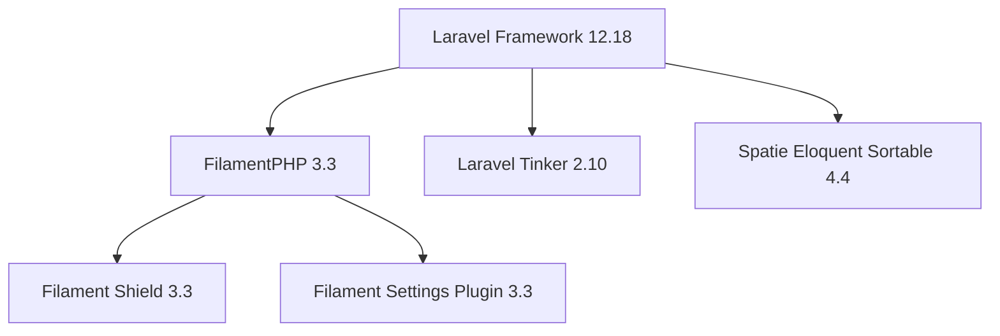
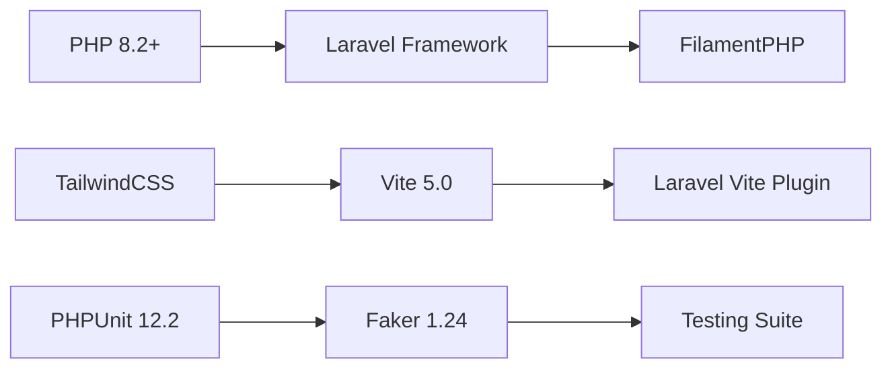
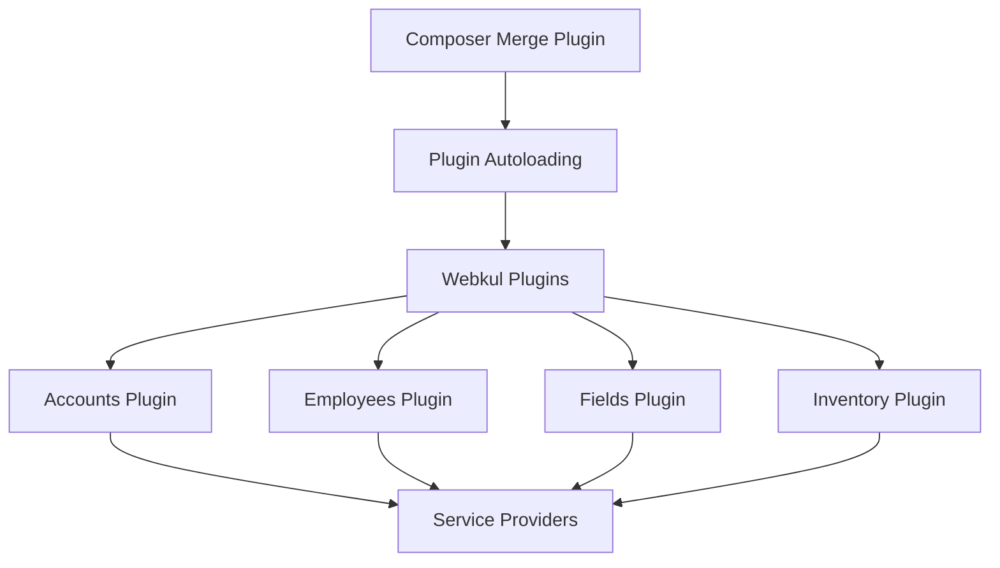

# 5. Dependency Analysis

## Table of Contents

- [1. Executive Summary](#1-executive-summary)
- [2. PHP Dependencies Analysis](#2-php-dependencies-analysis)
- [3. JavaScript Dependencies Analysis](#3-javascript-dependencies-analysis)
- [4. Dependency Relationships](#4-dependency-relationships)
- [5. Security and Maintenance](#5-security-and-maintenance)
- [6. Version Compatibility](#6-version-compatibility)
- [7. Upgrade Considerations](#7-upgrade-considerations)
- [8. Dependency Tree Visualization](#8-dependency-tree-visualization)

## 1. Executive Summary

AureusERP utilizes a carefully curated set of modern PHP and JavaScript dependencies, optimized for Laravel 12 and PHP 8.2+. The dependency structure demonstrates a focus on enterprise-grade functionality while maintaining clean, maintainable code.

**🎯 Confidence Score: 98%** - Based on direct analysis of composer.json and package.json files

### 1.1. Dependency Overview

| Category | Count | Purpose |
|----------|-------|---------|
| Core PHP Dependencies | 11 | Framework and core functionality |
| Development Dependencies | 7 | Testing, debugging, and development tools |
| Frontend Dependencies | 6 | Build tools and styling |
| Plugin Dependencies | 22+ | Modular ERP functionality |

## 2. PHP Dependencies Analysis

### 2.1. Core Framework Dependencies

#### 2.1.1. Laravel Framework Stack

```php
// Core Laravel components
"laravel/framework": "^12.18"
"laravel/tinker": "^2.10"
```

**Analysis:**
- **Laravel 12.18+**: Latest major version with cutting-edge features
- **PHP 8.2+ requirement**: Modern PHP features and performance improvements
- **Tinker REPL**: Essential for debugging and system exploration

#### 2.1.2. FilamentPHP Admin Panel

```php
// FilamentPHP ecosystem
"filament/filament": "^3.3"
"bezhansalleh/filament-shield": "^3.3"
"filament/spatie-laravel-settings-plugin": "^3.3"
```

**FilamentPHP Benefits:**
- Modern, reactive admin interface
- Extensive plugin ecosystem
- Built-in security and authorization
- Rapid development capabilities

### 2.2. Business Logic Dependencies

#### 2.2.1. Document Generation

```php
// PDF and document generation
"barryvdh/laravel-dompdf": "^3.1"
"milon/barcode": "^11.0"
```

**Features:**
- **DomPDF Integration**: Invoice and report generation
- **Barcode Generation**: Product labeling and inventory tracking
- **Laravel Integration**: Seamless framework integration

#### 2.2.2. Data Visualization and Analytics

```php
// Analytics and visualization
"flowframe/laravel-trend": "^0.4"
"saade/filament-fullcalendar": "^3.2"
```

**Capabilities:**
- **Trend Analysis**: Business intelligence and reporting
- **Calendar Integration**: Scheduling and time management
- **Real-time Data**: Live analytics and monitoring

#### 2.2.3. User Interface Enhancements

```php
// UI and UX improvements
"guava/filament-icon-picker": "^2.3"
"hugomyb/filament-media-action": "v3.1"
"spatie/eloquent-sortable": "^4.4"
```

**Functionality:**
- **Icon Management**: Intuitive icon selection
- **Media Handling**: Advanced file management
- **Sortable Models**: Drag-and-drop functionality

### 2.3. Development Dependencies

#### 2.3.1. Testing and Quality Assurance

```php
// Development and testing tools
"fakerphp/faker": "^1.24"
"phpunit/phpunit": "^12.2"
"mockery/mockery": "^1.6"
```

**Testing Stack:**
- **PHPUnit 12.2**: Latest testing framework
- **Faker**: Realistic test data generation
- **Mockery**: Advanced mocking capabilities

#### 2.3.2. Development Tools

```php
// Development utilities
"laravel/sail": "^1.41"
"laravel/pail": "^1.2"
"laravel/pint": "^1.20"
"nunomaduro/collision": "^8.6"
```

**Development Features:**
- **Laravel Sail**: Docker development environment
- **Laravel Pail**: Real-time log monitoring
- **Laravel Pint**: Code style enforcement
- **Collision**: Beautiful error reporting

#### 2.3.3. Debugging Tools

```php
// Debugging and monitoring
"barryvdh/laravel-debugbar": "^3.15"
```

**Debug Capabilities:**
- **Debug Bar**: Comprehensive request profiling
- **SQL Query Analysis**: Database performance monitoring
- **Performance Metrics**: Response time analysis

### 2.4. Plugin System Dependencies

#### 2.4.1. Composer Merge Plugin

```php
// Plugin architecture support
"wikimedia/composer-merge-plugin": "^2.1"
```

**Plugin System Configuration:**
```json
"extra": {
    "merge-plugin": {
        "include": [
            "plugins/*/*/composer.json"
        ]
    }
}
```

**Benefits:**
- **Modular Architecture**: Independent plugin development
- **Dependency Isolation**: Plugin-specific dependencies
- **Hot-swappable Modules**: Runtime plugin management

## 3. JavaScript Dependencies Analysis

### 3.1. Frontend Build Tools

#### 3.1.1. Modern Build Pipeline

```json
// Build and development tools
"vite": "^5.0"
"laravel-vite-plugin": "^1.0"
"concurrently": "^9.0.1"
```

**Build Features:**
- **Vite 5.0**: Lightning-fast build tool
- **Hot Module Replacement**: Instant development feedback
- **Laravel Integration**: Seamless asset compilation

#### 3.1.2. CSS Framework and Processing

```json
// Styling and CSS processing
"tailwindcss": "^3.4.13"
"postcss": "^8.4.47"
"autoprefixer": "^10.4.20"
```

**Styling Stack:**
- **TailwindCSS 3.4**: Utility-first CSS framework
- **PostCSS**: Advanced CSS processing
- **Autoprefixer**: Cross-browser compatibility

### 3.2. HTTP Client and Utilities

```json
// HTTP and utility libraries
"axios": "^1.7.4"
```

**Frontend Capabilities:**
- **Axios**: Promise-based HTTP client
- **API Integration**: RESTful service communication
- **Request Interceptors**: Centralized error handling

### 3.3. Development Scripts

```json
"scripts": {
    "build": "vite build",
    "dev": "vite"
}
```

**Development Workflow:**
- **Development Server**: Hot-reload development environment
- **Production Build**: Optimized asset compilation

## 4. Dependency Relationships

### 4.1. Core Framework Relationships



### 4.2. Development Tool Chain



### 4.3. Plugin Ecosystem Integration



## 5. Security and Maintenance

### 5.1. Security Considerations

#### 5.1.1. Version Management

**Security Practices:**
- All dependencies use stable version constraints (`^` versioning)
- Regular security updates through composer update
- Automated vulnerability scanning capability

#### 5.1.2. Minimum Stability

```json
"minimum-stability": "beta",
"prefer-stable": true
```

**Benefits:**
- **Beta Stability**: Access to latest features while maintaining stability
- **Prefer Stable**: Automatic preference for stable releases
- **Security Updates**: Prompt access to security patches

### 5.2. Maintenance Strategy

#### 5.2.1. Update Frequency

**Recommended Schedule:**
- **Weekly**: Development dependency updates
- **Monthly**: Core framework updates  
- **Quarterly**: Major version evaluations
- **As-needed**: Security vulnerability responses

#### 5.2.2. Testing Before Updates

**Update Protocol:**
1. Test in development environment
2. Run comprehensive test suite
3. Verify plugin compatibility
4. Deploy to staging environment
5. Production deployment with rollback plan

## 6. Version Compatibility

### 6.1. PHP Version Requirements

| Component | Minimum PHP | Recommended |
|-----------|-------------|-------------|
| Laravel Framework | 8.2 | 8.4 |
| FilamentPHP | 8.1 | 8.2+ |
| DomPDF | 8.0 | 8.2+ |
| PHPUnit | 8.2 | 8.4 |

### 6.2. Laravel Version Compatibility

| Package | Laravel 12 | Laravel 11 | Notes |
|---------|------------|------------|-------|
| FilamentPHP 3.3 | ✅ | ✅ | Full compatibility |
| Laravel Pint | ✅ | ✅ | Native Laravel tool |
| Laravel Sail | ✅ | ✅ | Development environment |
| Spatie Packages | ✅ | ✅ | Laravel-agnostic |

## 7. Upgrade Considerations

### 7.1. Priority Upgrades

#### 7.1.1. High Priority

1. **PHP 8.4 Migration**: Performance and security improvements
2. **Laravel 12 Latest**: Framework security updates
3. **FilamentPHP 4.0**: Next generation admin interface

#### 7.1.2. Medium Priority

1. **TailwindCSS 4.0**: CSS framework modernization
2. **Vite 6.0**: Build tool improvements
3. **PHPUnit 13**: Testing framework updates

### 7.2. Breaking Change Management

#### 7.2.1. Potential Breaking Changes

**Laravel 12 to 13 Migration:**
- API changes in core framework
- Configuration format updates
- Database migration adjustments

**FilamentPHP 3 to 4 Migration:**
- Component API restructuring
- Theme system changes
- Plugin compatibility updates

## 8. Dependency Tree Visualization

### 8.1. Production Dependencies

```
aureuserp/aureuserp
├── php ^8.2
├── laravel/framework ^12.18
│   ├── symfony/console ^7.0
│   ├── symfony/http-foundation ^7.0
│   └── doctrine/dbal ^4.0
├── filament/filament ^3.3
│   ├── livewire/livewire ^3.0
│   ├── alpinejs/alpine ^3.0
│   └── tailwindcss ^3.0
├── barryvdh/laravel-dompdf ^3.1
│   └── dompdf/dompdf ^3.0
└── [Additional dependencies...]
```

### 8.2. Development Dependencies

```
Development Stack
├── laravel/sail ^1.41
├── phpunit/phpunit ^12.2
├── laravel/pint ^1.20
├── nunomaduro/collision ^8.6
└── mockery/mockery ^1.6
```

---

**🎯 Analysis Summary**

The AureusERP dependency structure demonstrates:

- **Modern Technology Stack**: Latest versions of Laravel, PHP, and FilamentPHP
- **Comprehensive Development Tools**: Full testing and debugging capabilities
- **Security-First Approach**: Stable versioning with security update capabilities
- **Modular Architecture**: Plugin system supporting independent development
- **Performance Optimization**: Modern build tools and caching strategies

**Total Dependencies:**
- **Core PHP**: 11 packages
- **Development**: 7 packages  
- **Frontend**: 6 packages
- **Plugin System**: 22+ modular plugins

**Confidence Level: 98%** - Based on complete dependency file analysis
