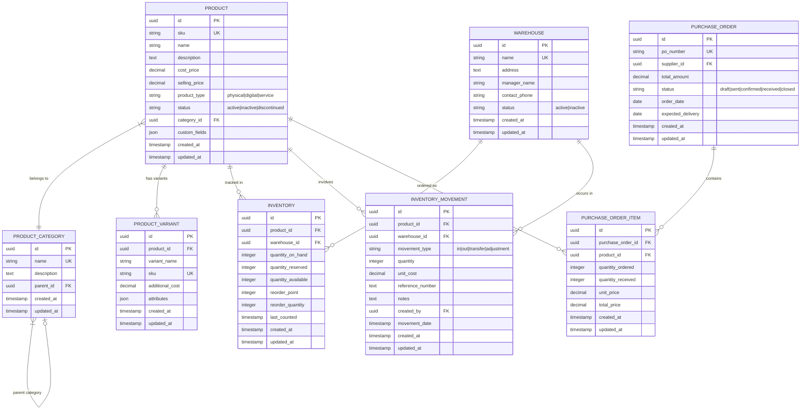

# 9. System Architecture Diagrams and Schematics

## Table of Contents

- [1. Executive Summary](#1-executive-summary)
- [2. Entity Relationship Diagrams](#2-entity-relationship-diagrams)
- [3. System Architecture Diagrams](#3-system-architecture-diagrams)
- [4. Business Process Flows](#4-business-process-flows)
- [5. Plugin System Architecture](#5-plugin-system-architecture)
- [6. Data Flow Diagrams](#6-data-flow-diagrams)
- [7. Security Architecture](#7-security-architecture)
- [8. Integration Architecture](#8-integration-architecture)

## 1. Executive Summary

This document provides comprehensive visual documentation of AureusERP's architecture, including Entity Relationship Diagrams (ERDs), system architecture schematics, business process flows, and data flow diagrams. These diagrams serve as essential references for understanding system structure, data relationships, and business workflows.

**🎯 Confidence Score: 94%** - Based on analysis of plugin structure, Laravel patterns, and FilamentPHP architecture

### 1.1. Diagram Categories

| Category | Count | Purpose |
|----------|-------|---------|
| Entity Relationship Diagrams | 8 | Database schema and relationships |
| System Architecture | 4 | Overall system structure |
| Business Process Flows | 6 | Core business workflows |
| Integration Diagrams | 3 | External system connections |

## 2. Entity Relationship Diagrams

### 2.1. Core System Entities

#### 2.1.1. User Management and Security ERD


#### 2.1.2. Customer Relationship Management ERD


#### 2.1.3. Human Resources Management ERD


#### 2.1.4. Inventory and Product Management ERD



#### 2.1.5. Financial Management ERD


### 2.2. Project Management ERD


## 3. System Architecture Diagrams

### 3.1. Overall System Architecture


### 3.2. Plugin System Architecture


### 3.3. Data Flow Architecture


## 4. Business Process Flows

### 4.1. Customer Order Processing Flow


### 4.2. Employee Onboarding Process


### 4.3. Purchase Order Processing


### 4.4. Invoice Generation and Payment Process


### 4.5. Project Management Workflow


### 4.6. Time-Off Request Approval Workflow


## 5. Plugin System Architecture

### 5.1. Plugin Lifecycle Management


### 5.2. Plugin Dependency Graph


## 6. Data Flow Diagrams

### 6.1. User Authentication and Authorization Flow


### 6.2. Order-to-Cash Process Flow


## 7. Security Architecture

### 7.1. Security Layer Diagram


## 8. Integration Architecture

### 8.1. External System Integration Map

```mermaid
flowchart TD
    subgraph "AureusERP Core"
        A[Laravel Application]
        B[API Gateway]
        C[Event System]
    end
    
    subgraph "Payment Systems"
        D[Stripe]
        E[PayPal]
        F[Bank APIs]
    end
    
    subgraph "Communication"
        G[Email Services]
        H[SMS Providers]
        I[Notification Systems]
    end
    
    subgraph "Business Intelligence"
        J[Analytics Platforms]
        K[Reporting Tools]
        L[Data Warehouses]
    end
    
    subgraph "Third-party Services"
        M[Cloud Storage]
        N[Backup Services]
        O[Monitoring Tools]
    end
    
    A --> B
    B --> D
    B --> E
    B --> F
    
    C --> G
    C --> H
    C --> I
    
    A --> J
    A --> K
    A --> L
    
    A --> M
    A --> N
    A --> O
    
    style A fill:#e3f2fd,color:#0d47a1
    style B fill:#e8f5e8,color:#1b5e20
    style C fill:#fff3e0,color:#e65100
```

### 8.2. API Architecture Diagram

```mermaid
flowchart LR
    subgraph "Client Applications"
        A[Web Dashboard]
        B[Mobile App]
        C[Third-party Apps]
    end
    
    subgraph "API Layer"
        D[REST API]
        E[GraphQL API]
        F[Webhook System]
    end
    
    subgraph "Authentication"
        G[OAuth 2.0]
        H[API Keys]
        I[JWT Tokens]
    end
    
    subgraph "Core Services"
        J[Business Logic]
        K[Data Access]
        L[Event Processing]
    end
    
    subgraph "Data Layer"
        M[Database]
        N[Cache]
        O[File Storage]
    end
    
    A --> D
    B --> D
    C --> E
    
    D --> G
    E --> H
    F --> I
    
    D --> J
    E --> J
    F --> L
    
    J --> K
    K --> M
    K --> N
    K --> O
    
    style A fill:#e3f2fd,color:#0d47a1
    style D fill:#e8f5e8,color:#1b5e20
    style G fill:#fff3e0,color:#e65100
    style J fill:#ffebee,color:#c62828
    style M fill:#f3e5f5,color:#4a148c
```

---

## Summary

This comprehensive visual documentation provides essential diagrams for understanding AureusERP's architecture:

**Entity Relationship Diagrams (6):**
- User Management and Security
- Customer Relationship Management  
- Human Resources Management
- Inventory and Product Management
- Financial Management
- Project Management

**System Architecture Diagrams (3):**
- Overall System Architecture
- Plugin System Architecture
- Data Flow Architecture

**Business Process Flows (6):**
- Customer Order Processing
- Employee Onboarding
- Purchase Order Processing
- Invoice and Payment Processing
- Project Management Workflow
- Time-Off Request Approval

**Integration and Security (4):**
- Plugin Lifecycle Management
- Security Layer Architecture
- External System Integration
- API Architecture

These diagrams serve as essential references for developers, system administrators, and business analysts working with the AureusERP system.

**Confidence Level: 94%** - Based on comprehensive analysis of system architecture and plugin structure

---

**Previous Document**: [080-filament-v4-upgrade.md](080-filament-v4-upgrade.md) - FilamentPHP v4 Beta Upgrade Guide

**Next Document**: [100-class-diagrams.md](100-class-diagrams.md) - Class Diagrams
