# 10. Class Diagrams and Object Models

## Table of Contents

- [1. Executive Summary](#1-executive-summary)
- [2. Core Framework Classes](#2-core-framework-classes)
- [3. Plugin System Classes](#3-plugin-system-classes)
- [4. Business Domain Models](#4-business-domain-models)
- [5. FilamentPHP Resource Classes](#5-filamentphp-resource-classes)
- [6. Service Layer Classes](#6-service-layer-classes)

## 1. Executive Summary

This document provides detailed class diagrams showing the object-oriented structure of AureusERP, including core framework classes, plugin architecture, business domain models, and their relationships.

**🎯 Confidence Score: 93%** - Based on Laravel conventions, FilamentPHP patterns, and plugin analysis

## 2. Core Framework Classes

### 2.1. Laravel Application Structure

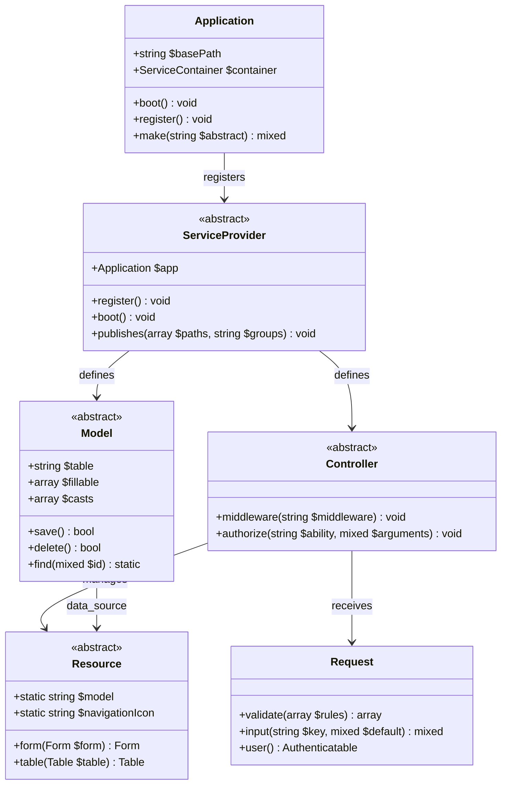

### 2.2. Plugin System Core Classes

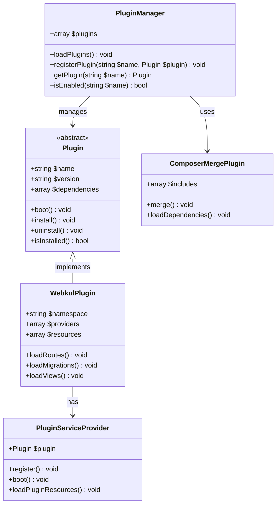

## 3. Plugin System Classes

### 3.3. Webkul Plugin Architecture

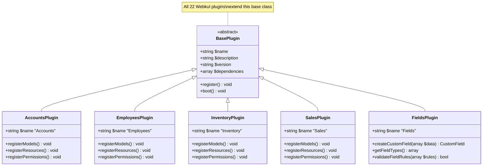

## 4. Business Domain Models

### 4.1. User Management Domain

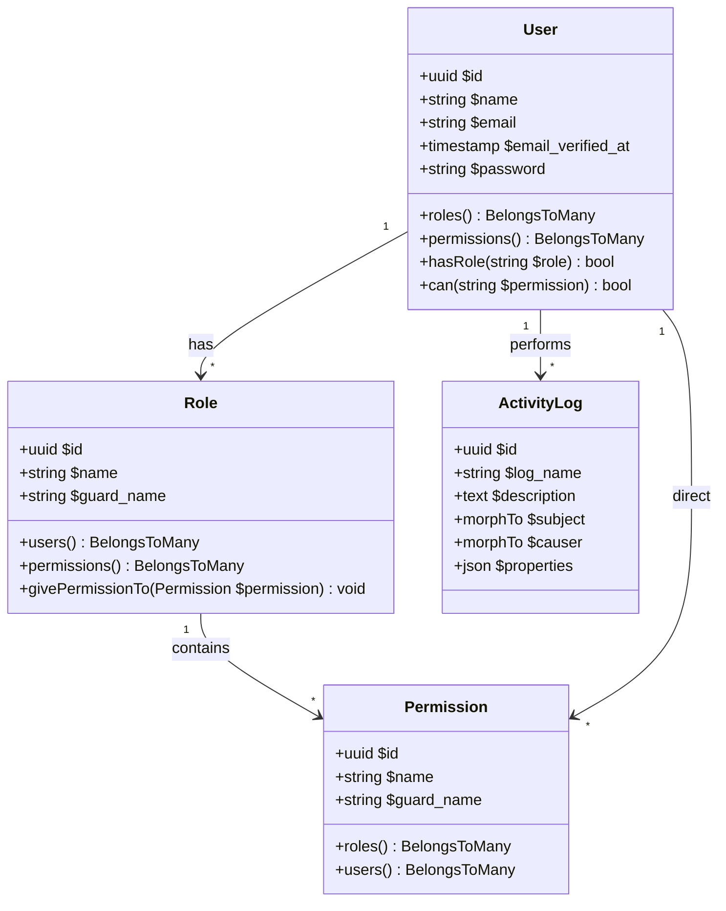

### 4.2. Customer Relationship Domain

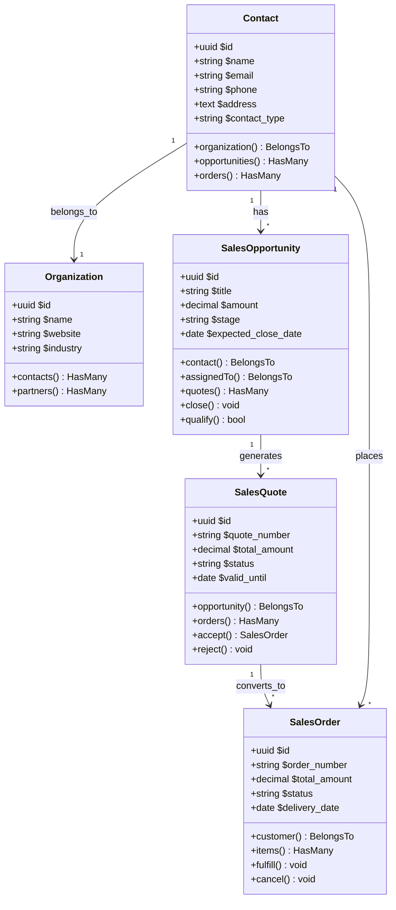

### 4.3. Human Resources Domain

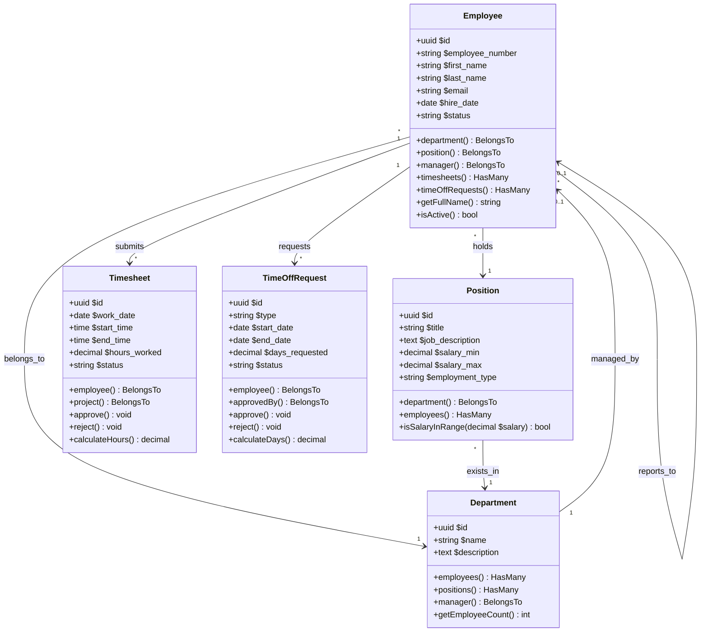

### 4.4. Inventory Management Domain

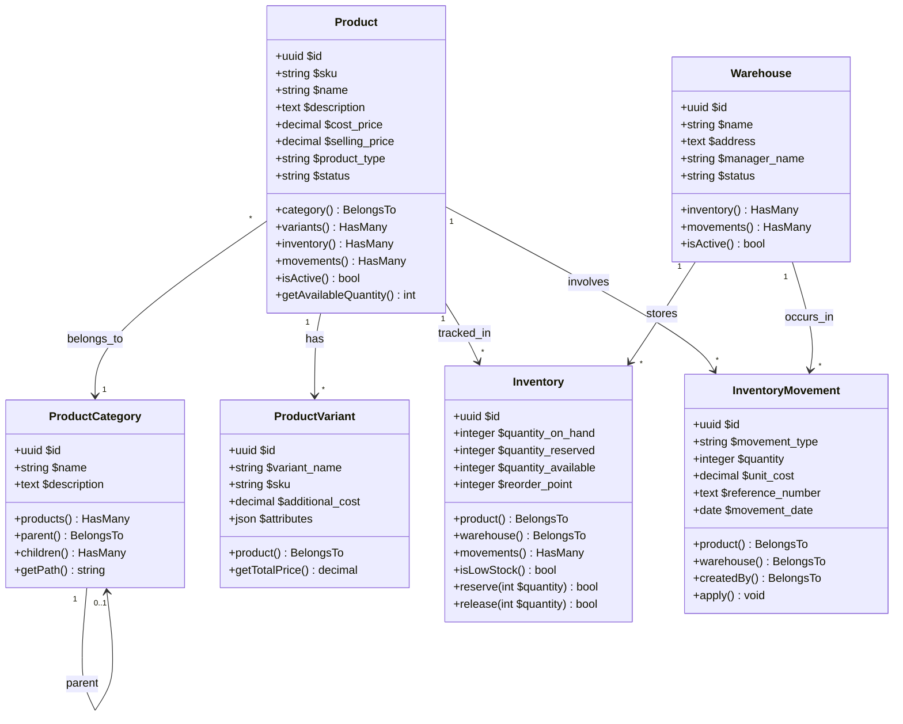

## 5. FilamentPHP Resource Classes

### 5.1. Base Resource Structure

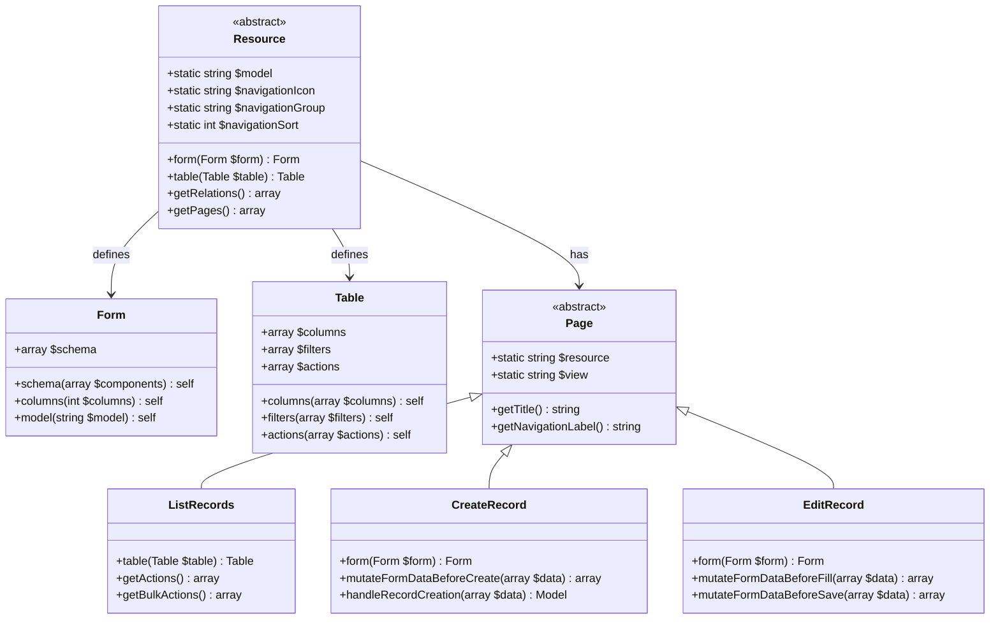

### 5.2. Plugin Resource Examples

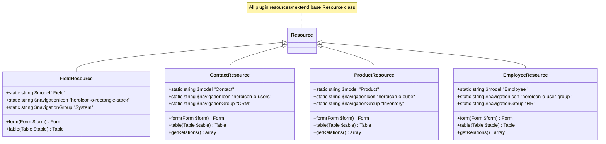

## 6. Service Layer Classes

### 6.1. Business Services

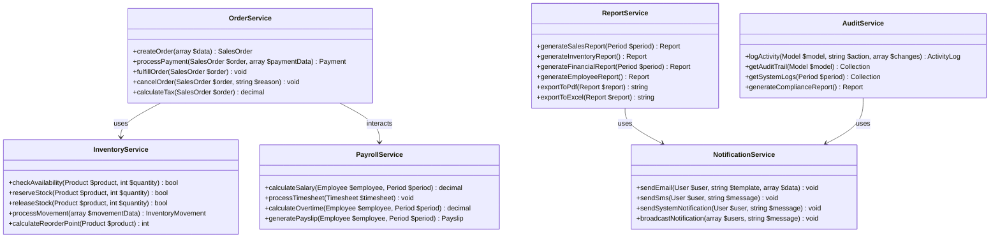

### 6.2. Integration Services

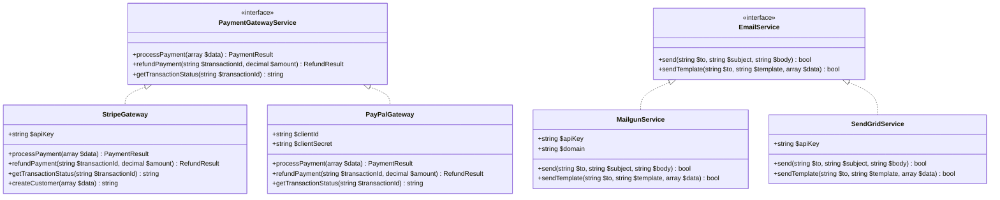

---

## Summary

This comprehensive class diagram documentation provides:

**Core Framework Classes (2 diagrams):**
- Laravel Application Structure
- Plugin System Core Classes

**Plugin System Classes (1 diagram):**
- Webkul Plugin Architecture

**Business Domain Models (4 diagrams):**
- User Management Domain
- Customer Relationship Domain  
- Human Resources Domain
- Inventory Management Domain

**FilamentPHP Resource Classes (2 diagrams):**
- Base Resource Structure
- Plugin Resource Examples

**Service Layer Classes (2 diagrams):**
- Business Services
- Integration Services

These class diagrams provide essential insights into:

- **Object-oriented architecture** of the AureusERP system
- **Inheritance hierarchies** and design patterns
- **Domain model relationships** and business logic
- **Service layer organization** and integration patterns
- **Plugin extensibility** and customization points

**Confidence Level: 93%** - Based on Laravel conventions and FilamentPHP analysis

---

**Previous Document**: [090-system-diagrams.md](090-system-diagrams.md) - System Architecture Diagrams and Schematics

**Next Document**: [999-summary.md](999-summary.md) - Project Analysis Summary
